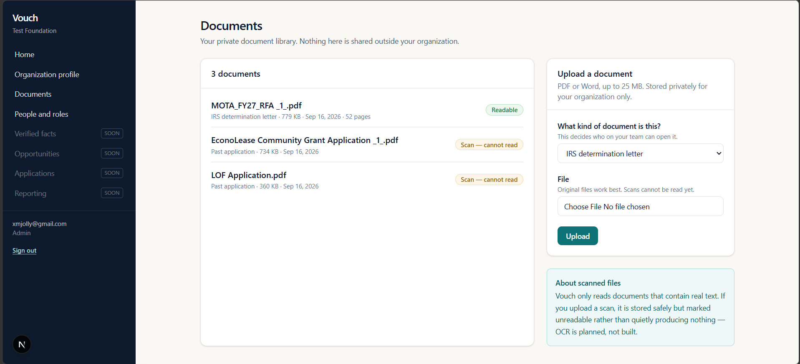
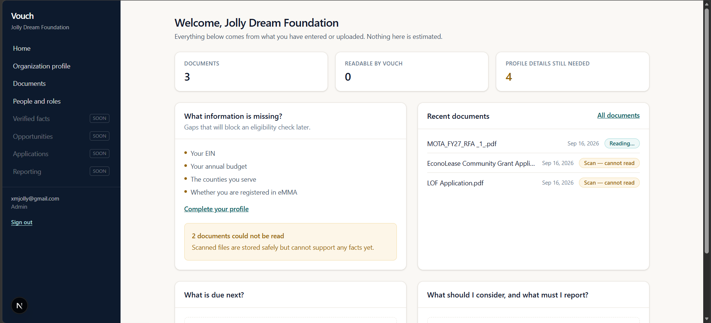

# Vouch

A source-backed grant and reimbursement assistant for very small community
nonprofits that cannot afford a dedicated grant writer.

The promise is narrow and specific: **Vouch never silently invents an
organizational fact.** Every factual statement links to an approved piece of
evidence, uncertain information is flagged rather than filled in, and nothing
reaches an export without a person approving it.

**Status: Milestone 1.** The tenant boundary is built and verified. No AI yet —
see [`docs/MILESTONES.md`](docs/MILESTONES.md).

## Screens



**One library, three outcomes.** A 52-page Maryland Department of Health RFA
read into 52 citable pages; two funder applications stored safely and marked
unreadable because they are scans with no text in them.

That refusal is the point. A scanned page yields an empty string rather than an
error, so without the check both of those would sit there looking successfully
processed, and every fact later drawn from them would have no support behind it.



**The dashboard shows only what the organization actually entered.** The panels
it cannot yet fill say so and name the phase that builds them. On a product
whose whole promise is not inventing things, a placeholder "3 opportunities"
tile would be the wrong first habit.

## What works today

- Email/password accounts
- Organizations, four roles, and an organization profile
- Private PDF and Word upload, validated server-side by magic bytes
- Per-page text extraction, with scanned documents refused rather than silently
  read as empty
- An append-only audit log
- Volunteers blocked from financial and personnel documents **by the database**,
  not by hiding a menu

## Quick start

Needs Node 20+ and a free Supabase project.

```bash
npm install
cp .env.example .env.local     # fill in the three values, see below
npm run dev
```

**Create the database.** In the Supabase dashboard, open **SQL Editor → New
query**, paste the whole of `supabase/migrations/0001_core.sql` and run it, then
do the same with `0002_storage.sql`. Order matters — the second file refers to
tables the first one creates. Afterwards the Table Editor should list five
tables, each with a green **RLS enabled** badge, and Storage should show a
private `org-documents` bucket.

**Fill in `.env.local`** from **Project Settings → API keys**:

| Variable | Value | Sensitivity |
|---|---|---|
| `NEXT_PUBLIC_SUPABASE_URL` | Project URL | Public |
| `NEXT_PUBLIC_SUPABASE_PUBLISHABLE_KEY` | Publishable key (`sb_publishable_…`) | Public — row-level security constrains it |
| `SUPABASE_SECRET_KEY` | Secret key (`sb_secret_…`) | **Bypasses all security. Server only.** Never give it a `NEXT_PUBLIC_` name |

Then <http://localhost:3000> — create an account, create your organization,
upload a document.

**To deploy:** `npx wrangler login`, put the two public values in the `vars`
block of `wrangler.jsonc`, then `npx wrangler secret put SUPABASE_SECRET_KEY`
and `npm run cf:deploy`. Add the resulting URL to Supabase's
**Authentication → URL Configuration → Redirect URLs**.

## Verify it

```bash
npm run test:rls        # 47 tenant isolation checks against a real Postgres
npm run test:extract    # 31 extraction and scan-detection checks
```

`test:rls` is the exit condition for Milestone 1. It creates two organizations
and four users and asserts forty-seven things that must be impossible —
cross-tenant reads and writes, volunteers opening financial documents, clients
forging extracted page text, anyone editing the audit log.

It runs the migrations as a deliberately **non-superuser** role, because a
superuser bypasses row-level security unconditionally and would let a policy
that denies everything in production pass the suite. That caught a real bug
during development: `FORCE ROW LEVEL SECURITY` looked safer and would have made
the membership check return false for every user on Supabase.

Run it after any change to `supabase/migrations/`.

## Stack

| Layer | Choice |
|---|---|
| App and server | Next.js 15, TypeScript, Tailwind CSS 4 |
| Hosting | Cloudflare Workers via OpenNext |
| Accounts, data, files | Supabase — Auth, Postgres with row-level security, private Storage |
| PDF text | `unpdf` (pdf.js for serverless) |
| DOCX text | No dependency — ZIP + `DecompressionStream`, in `src/lib/extract/docx.ts` |

Why Cloudflare hosts but does not store: [`docs/DECISIONS.md`](docs/DECISIONS.md),
decision 1.

## Layout

```
supabase/migrations/   Schema and RLS. The security model lives here.
supabase/tests/        Tenant isolation suite.
src/lib/extract/       Turning uploaded bytes into citable page text.
src/lib/supabase/      Three clients: user, browser, and service role.
src/app/(app)/         Signed-in application.
docs/                  Decisions and their tradeoffs; the milestone plan.
screenshots/           Images used by this README.
```

## Reading order for a new contributor

1. `supabase/migrations/0001_core.sql` — the schema, and every security policy
2. `supabase/tests/01_isolation.sql` — what must be impossible
3. [`docs/DECISIONS.md`](docs/DECISIONS.md) — why it is built this way
4. [`docs/MILESTONES.md`](docs/MILESTONES.md) — what comes next

The security model is not a separate document: it is the policies in
`0001_core.sql` and the assertions in `01_isolation.sql`. Every policy has a
comment above it saying what it is protecting against.

## Reporting a security issue

This holds nonprofits' financial statements and board lists, so a report is
genuinely welcome. Email **xmjolly@gmail.com** with what you found and how to
reproduce it, and please don't open a public issue for anything exploitable.

It is a one-person project, so expect a reply in days rather than hours. Known
weaknesses are listed below — those are already understood, and reports about
them are not needed.

**Known gaps, as of Milestone 1.** None block a pilot; all should close before
anyone relies on this.

- No rate limiting on sign-in or upload
- No retention or deletion path — `organizations` has no delete policy at all
- No virus scanning on uploads
- Password policy is length-only (10 characters); no multi-factor authentication
- `document_pages.content` is stored as plaintext in the database, as it must be
  to stay searchable and citable. Encryption at rest is Supabase's, not ours
- Nothing is sent to an AI provider yet. Before that changes, users have to be
  told plainly what leaves the system and where it goes

## Not being built

Automatic submission, a national grant database, a nonprofit CRM, donor
management, accounting, native mobile apps, browser autofill, automated budget
generation, or award predictions.
